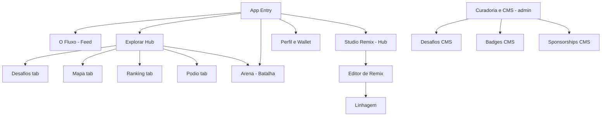

# UPMM Perifa Lab — Sitemap & Navigation IA Redesign

## Purpose

This document records the canonical information architecture (IA) for the UPMM Perifa Lab SPA, the decisions that resolve the navigation/journey issues found in the audit, and the concrete implementation notes. It is the source of truth for the navigation redesign work.

## Current State (as-audited)

Declared routes live in [`App.tsx`](../../App.tsx:1320). Three navigation surfaces expose them: the desktop sidebar ([`App.tsx`](../../App.tsx:1062)), the mobile bottom nav ([`MobileBottomNavBar.tsx`](../../components/MobileBottomNavBar.tsx:35)), and the universal search modal (⌘K / Ctrl+K).

Key problems identified:
1. Mobile nav does not expose `/explore` or `/challenges`.
2. Ranking, Podium, Map, and Challenges each exist as both a standalone route and a tab inside `/explore` (duplicate destinations).
3. `/top-artistas` is an orphaned alias of `/ranking`.
4. Sidebar [02] "Arena & Pódio" navigates to `/battle` while also claiming `/ranking` and `/podium-remixes` as active.
5. Sidebar [03] "Studio Remix" targets `photos[0].id` (data-order dependent).
6. `/remix*` silently redirects to `/` for logged-out users, losing intent.
7. No 404 fallback route.
8. "Simular Curador" demo toggle is visible to all users.
9. Primary-journey CTAs are `
` without keyboard/ARIA support.
10. No back/breadcrumb affordance on deep routes.
11. Accent palette is fragmented across `#FFB800`, `#FACC15`, `#FF5722`, `#00E5FF`.
12. Empty/loading/error states are inconsistent across routes.

## Target IA (canonical routes)

| Route | Component | Notes |
|---|---|---|
| `/` | Feed — "O Fluxo" | Home |
| `/explore` | ExploreHub | Single discovery hub; tabs deep-link via `?tab=` |
| `/map` | PalmasRealMap | Kept standalone for `map?photoId=` deep links |
| `/challenges` | WeeklyChallenges | Kept standalone; also a tab in ExploreHub |
| `/battle` | VibeBattle | Arena 1v1 |
| `/ranking` | BattleRanking | Reads `?tab=all|artists` |
| `/top-artistas` | → `<Navigate to="/ranking?tab=artists" replace />` | Alias removed |
| `/podium-remixes` | RemixPodium | Canonical |
| `/remix-podium` | → redirect to `/podium-remixes` | Legacy alias (already exists) |
| `/lineage/:photoId` | LineageView | Detail branch |
| `/remix` | StudioRemixHub (new) | Remix landing: lists base walls to choose |
| `/remix/:photoId` | Editor | Auth-gated editor |
| `/profile` | ProfileDashboard | Alias for current user |
| `/profile/:userId` | ProfileDashboard | Public profile |
| `/curadoria` | CuradoriaPopularCMS | Admin |
| `/admin/challenges` | AdminChallengesCMS | Admin |
| `/admin/badges` | BadgeCMS | Admin |
| `/admin/sponsorships` | AdminSponsorshipCMS | Admin |
| `*` | NotFound (new) | Catch-all |

## Decisions

### D1 — Canonical routes and duplicate resolution
- `/ranking` becomes the single ranking route, reading `?tab=all|artists`. `BattleRanking` must read `tab` from the URL query (currently it only receives `initialTab` as a prop).
- `/top-artistas` becomes a redirect to `/ranking?tab=artists`.
- `/map`, `/challenges`, `/podium-remixes` remain standalone routes (needed for deep links) but are reached through ExploreHub tabs in navigation. No second copy of the content is rendered — ExploreHub tabs should navigate to the standalone routes or render the same components, but there must be one canonical URL per destination.

### D2 — Desktop sidebar IA
- Módulos Centrais:
  - [01] O Fluxo → `/`
  - [02] Arena → `/battle` (renamed; remove the active-state coupling with `/ranking` and `/podium-remixes`)
  - [03] Studio Remix → `/remix` (hub, not `photos[0]`)
  - [04] Perfil & Wallet → `/profile/:id`
- Território & Fomento:
  - Explorar Hub → `/explore`
  - Editais & Desafios → `/challenges`
  - Mapa da Visão → `/map`
  - Pódio de Remixes → `/podium-remixes`
  - Ranking → `/ranking`

### D3 — Mobile bottom nav
Final slots: **Fluxo (`/`), Explorar (`/explore`), FAB Create, Arena (`/battle`), Perfil (`/profile/:id`)**.
- Mapa and Desafios become one tap inside Explorar Hub (they are already ExploreHub tabs).
- Map remains deep-linkable via `/map?photoId=`.

### D4 — Auth-gated remix with intent preservation
- `/remix` and `/remix/:photoId` must no longer silently `<Navigate to="/" />`.
- Logged-out flow: open AuthModal with reason copy ("Para remixar...") and store the intended path (`returnTo`). On successful login, navigate to `returnTo`.
- Logged-in flow: unchanged.

### D5 — Demo/admin control
- "Simular Curador" toggle renders only when `currentUser?.isAdmin === true` (real admin), never for guests or demo mode.

### D6 — Accessibility of primary CTAs
- Replace `
` CTA cards with semantic `<button>` or `<Link>` elements including keyboard behavior and ARIA labels.

### D7 — Accent color tokens
- Extend the palette in [`constants.ts`](../../constants.ts:17) (or a CSS custom-property set in [`index.css`](../../index.css:1)) to include all accent colors currently hardcoded: `#FFB800` (primary), `#FACC15` (accent yellow), `#FF5722` (orange/action), `#00E5FF` (cyan/territory), plus dark surface tokens.
- Replace hardcoded hex values across components with the tokens.

### D8 — States and fallbacks
- Add `NotFound` component and a `path="*"` route.
- Add back/breadcrumb affordance on `/lineage/:photoId`, `/remix/:photoId`, and `/profile/:userId`.
- Audit empty/loading/error states per route and standardize copy + next-step affordances.

## Files to touch

- [`App.tsx`](../../App.tsx) — routes, sidebar, CTA cards, auth redirects, demo toggle, `*` route.
- [`components/MobileBottomNavBar.tsx`](../../components/MobileBottomNavBar.tsx) — new slot layout.
- [`components/BattleRanking.tsx`](../../components/BattleRanking.tsx) — URL tab param support.
- `components/StudioRemixHub.tsx` — new remix landing.
- `components/NotFound.tsx` — new 404 state.
- [`constants.ts`](../../constants.ts) / [`index.css`](../../index.css) — accent tokens.
- Components with `
` CTAs: [`App.tsx`](../../App.tsx:2232), [`App.tsx`](../../App.tsx:2265), [`ExploreHub.tsx`](../../components/ExploreHub.tsx) (verify all).

## Out of scope

- Backend/Supabase schema changes.
- Content strategy and microcopy rewrites beyond the state/error audit.
- Visual redesign of individual page content (this is an IA/navigation pass).
